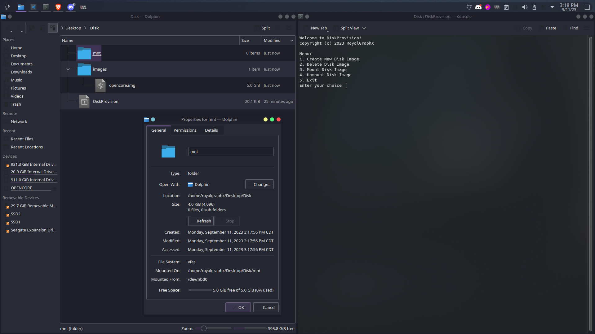

<p align="center">
  
</p>

<h1 align="center">Pre-Release Version 0.0.3</h1>
<h4 align="center">Allows the creation, management, and updating of disk images for use with Virtual Machines.</h4>

## About

This tool automates the process of creating and managing disk images for use with QEMU. It can perform the following actions:

- Create multiple FAT32 Formatted Disk Images.
- Save created images in a container directory.
- Delete previously created Disk Images.
- Mount a created Disk Image to a folder for easy modification.
- Unmount and disconnect Disk Images.

## Requirements

* Packages/Dependencies:
  * mkfs.fat (usually provided by dosfstools)
  * qemu-img (usually provided by qemu-utils)
  * qemu-nbd (usually provided by qemu-utils)

## Showcase

<p align="center">
  
</p>

## Usage

Open a terminal and navigate to the directory containing the executable file.

1. Ensure the executable has executable permissions:

```bash
chmod +x DiskProvision
```

2. You can now interact with DiskProvision:

```bash
./DiskProvision
```

```
Welcome to DiskProvision!
Copyright (c) 2023 RoyalGraphX
Linux x86_64 Pre-Release 0.0.2

Menu:
1. Create New Disk Image
2. Delete Disk Image
3. Mount Disk Image
4. Unmount Disk Image
5. Exit

Enter your choice:
```

## Creating a new Raw Disk Image

From the main menu, you can select Choice 1. Here is some example output of creating a new Raw Disk Image.

```bash
Available free space before creating the image: 593.81 GB
Choose the image format:
1. Raw
2. QCOW2
Enter your choice (1 or 2): 1
Enter the name for the disk image (without .img extension): TestImage
Enter the size (in GB) for the disk image (e.g., 1): 5
Formatting 'images/TestImage.img', fmt=raw size=5368709120
Disk image 'images/TestImage' created successfully.
[sudo] password for royalgraphx: 
Disk image 'TestImage' connected to /dev/nbd0.
mkfs.fat 4.2 (2021-01-31)
Disk image 'TESTIMAGE' formatted successfully.
/dev/nbd0 disconnected
Disk image disconnected from /dev/nbd0.
```

## Mounting a Disk Image

From the main menu, you can select Choice 3. Here is some example output of mounting an existing Disk Image.

```bash
1. TestImage.img
Enter the number of the image to mount (1-1): 1
nbd module is already loaded. Proceeding...
/dev/nbd0 is already connected. Disconnecting...
/dev/nbd0 disconnected
Image 'TestImage.img' mounted as /dev/nbd0.
Created 'mnt' directory.
Image mounted to 'mnt' directory successfully.
```

## Unmounting the currently connected Disk Image

From the main menu, you can select Choice 4. Here is some example output of unmounting a currently connected Disk Image.

```bash
Image unmounted.
/dev/nbd0 disconnected
NBD device disconnected.
Directory 'mnt' removed.
```

## Deleting a previously created Disk Image

From the main menu, you can select Choice 2. Here is some example output of deleting a Disk Image.

```bash
Disk images available for deletion:
1. TestImage.img
Enter the number of the image to delete (1-1): 1
Are you sure you want to delete 'TestImage.img'? (y/n): y
Disk image 'TestImage.img' deleted successfully.
```